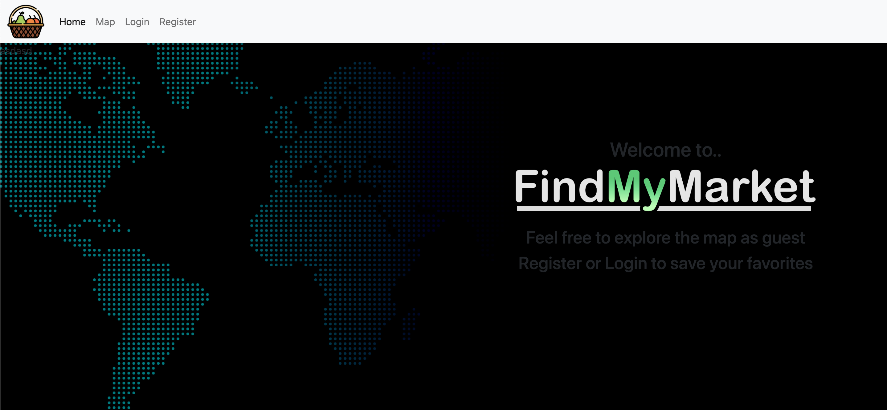
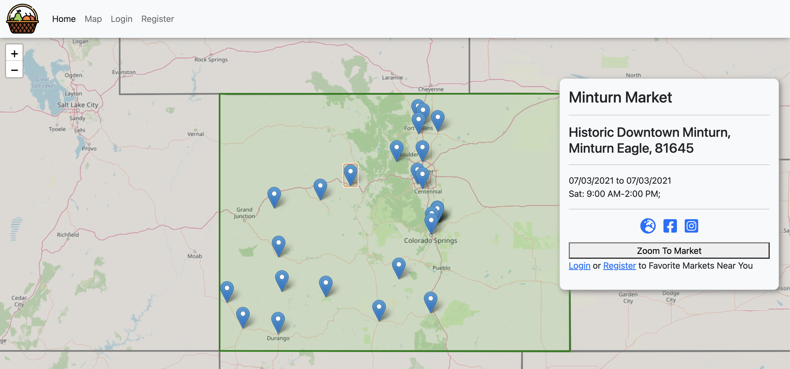

# FindMyMarket

A personal project for fun, designed to exercise my curiousity of the week. Leverages my current map knowledge, while utilizing a larger dataset (10K records).

# Setup

- Pull the repo to your computer.
- Run `bundle install`
- Run `rails db:{create,migrate,seed}`

# Screenshots
Home View

Map View

